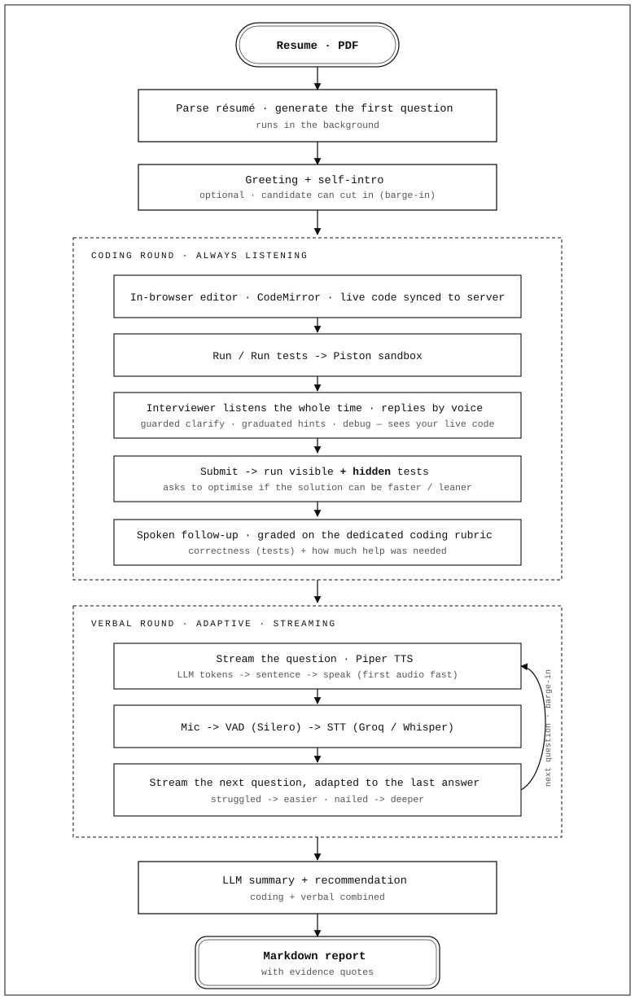

# FinalRound

**🎙 [Try the live demo →](https://finalround.up.railway.app/)**

An open-source, voice-based AI interviewer. It parses a candidate's resume,
conducts a spoken interview over a **STT → LLM → TTS** pipeline, and produces a
structured hiring report at the end.

The verbal round is **adaptive** — each question is chosen on the fly from how
the candidate answered the last one (struggled → easier or a new topic; nailed
it → go deeper), so it behaves like a real interviewer rather than reading a
fixed list.

It also runs a **coding round**: the candidate solves a problem in an in-browser
editor, runs it against visible test cases (executed in a sandboxed
[Piston](https://github.com/engineer-man/piston) engine), and the interviewer
asks a spoken follow-up about their code. Submissions are graded against
**hidden test cases** too (never sent to the browser) to discourage hard-coding.

Runs locally on CPU (GPU optional). Pluggable backends — the **LLM** is local
`llama.cpp` or Gemini, and **STT** is local `faster-whisper` or hosted Groq
(`whisper-large-v3`) with automatic fallback to local Whisper.

---

## How it works

<p align="center">
  
</p>

Two ways to run it:

- **CLI pipeline** (`backend/pipeline.py`) — local mic/speaker via `sounddevice`
- **WebSocket server** (`backend/main.py`) — browser streams audio over a socket

---

## Install

Requires Python 3.10+.

```bash
python -m venv venv
venv\Scripts\activate          # Windows
# source venv/bin/activate     # macOS/Linux

pip install -e .
```

CPU-only PyTorch (recommended unless you have CUDA set up):

```bash
pip install torch --index-url https://download.pytorch.org/whl/cpu
```

For the **local** `llama.cpp` LLM backend (needs a C/C++ toolchain to build):

```bash
pip install -e ".[local]"     # or ".[cuda]" / ".[metal]"
```

By default the project uses the Gemini backend, which doesn't need `llama-cpp-python`.

### Code execution engine (for the coding round)

The coding round runs candidate code in a self-hosted **Piston** container
(Docker, Linux engine). Set it up once — see **[docs/piston_setup.md](docs/piston_setup.md)**
for the full guide. In short:

```bash
docker volume create piston_packages
docker run -d --name piston_api -p 2000:2000 \
  -v piston_packages:/piston/packages --privileged ghcr.io/engineer-man/piston
# then install the Python and C++ (gcc) runtimes — see the doc
```

If Piston isn't reachable, set `interview.coding_enabled: false` in `config.yaml`
to skip the coding round.

### Quick start

After installing, set up your LLM key and launch:

```bash
echo "GEMINI_API_KEY=your-key-here" > .env
# optional: hosted STT (fast + accurate). Falls back to local Whisper if unset/down.
echo "GROQ_API_KEY=your-key-here" >> .env

ai-interviewer --start
```

> The `.env` is read relative to the working directory — launch from the repo root.

`ai-interviewer --start` runs the WebSocket server in the current terminal and opens the
frontend in Chrome (`http://localhost:8000`). Use the browser to enter your name,
upload a resume, and take the interview. Stop with `Ctrl+C`.

```
ai-interviewer --start [--host HOST] [--port PORT] [--no-browser]
```

## Running

### Browser (recommended)

```bash
ai-interviewer --start
```

Boots the server and opens the frontend in Chrome. See [Quick start](#quick-start).

### WebSocket server (manual)

```bash
ai-interviewer --start --no-browser
# or directly:
venv\Scripts\python.exe -m uvicorn backend.main:app --port 8000
```

- Swagger UI: http://127.0.0.1:8000/docs (REST routes only; WS routes aren't listed)
- `POST /upload` — multipart PDF, returns `{ "session_id": "..." }`
- `WebSocket /ws/{session_id}` — drives the interview

### CLI pipeline (local mic/speaker)

```bash
venv\Scripts\python.exe -m backend.pipeline
```

### Terminal test client (end-to-end WS test)

Drives the full WebSocket flow from the terminal using your mic/speakers —
useful for testing the backend without a browser:

```bash
venv\Scripts\python.exe -m backend.test_client docs/Ravi_AI.pdf Ravi
```

---

## Status

- [x] Resume parsing, question generation
- [x] VAD + STT + TTS + LLM pipeline (CLI)
- [x] Report generation + markdown export
- [x] WebSocket backend (tested end-to-end)
- [x] Browser frontend (`ai-interviewer --start`)
- [x] Background transcription/evaluation (overlapped with the interview)
- [x] Hosted Groq STT with automatic local-Whisper fallback (provider toggle)
- [x] Adaptive questioning — next question picked from the last answer's mastery
- [x] Grounded, conversational follow-ups (acknowledge then ask)
- [x] Streaming follow-up: LLM tokens → per-sentence TTS (~4x faster to first audio)
- [x] Silence handling: nudge the candidate twice, then end gracefully
- [x] Coding round: in-browser editor, sandboxed Piston execution, visible test cases
- [x] Hidden test cases for grading (anti-gaming) + solver-driven bank builder
- [x] Coding graded on correctness (test results) via a dedicated coding rubric
- [x] Combined report (coding + verbal) with evidence quotes
- [x] Resilient to a down execution engine; mid-interview restart button

See `handover.md` for current working notes.

---

## License

MIT
